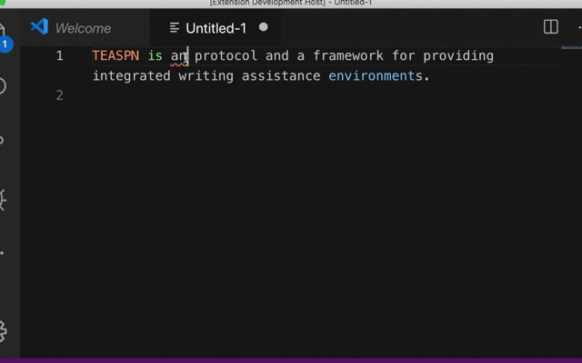
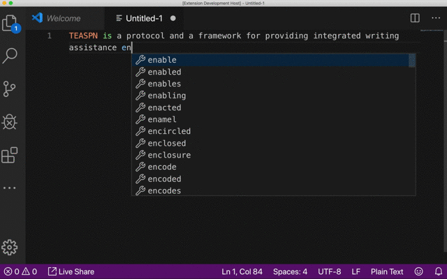
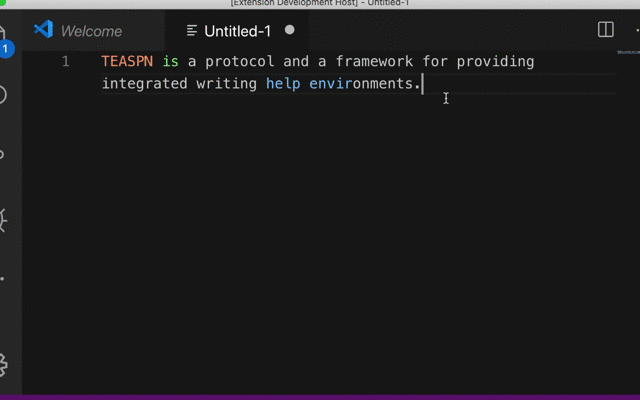
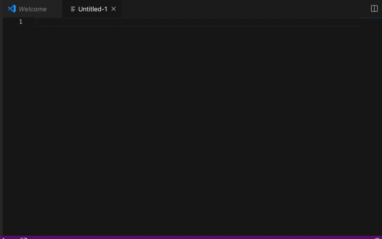
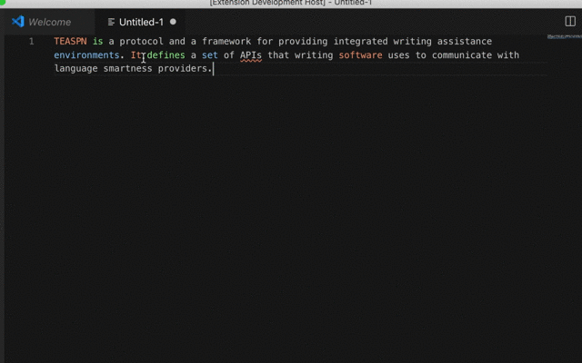
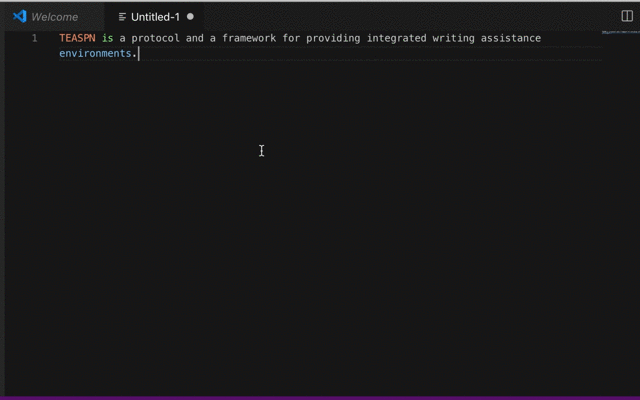

# TEASPN Server


## Overview
This is a sample implementation of the [TEASPN](https://www.teaspn.org/) server supporting neural auto-completion and paraphrasing.


## Prerequisites

+ [TEASPN SDK cilent](https://github.com/teaspn/teaspn-sdk)
+ [Docker](https://docs.docker.com/install/)
+ [Docker Compose](https://docs.docker.com/compose/install/)

## Install

1. Build an image from the Dockerfile and pull images from the registry. Note that this may take a while (10-30 mins) depending on your environment. 
    ``` 
    docker-compose build
    docker-compose pull
    ```

2. Download and build the Elasticsearch index. This also takes a while. 
    ```
    mkdir elasticsearch_indexes
    curl -sLJ --output elasticsearch_indexes/tatoeba_ja.index 'https://teaspn.s3.amazonaws.com/server/0.0.1/assets/tatoeba_ja.index'

    docker-compose up -d elasticsearch
    docker run --net=host --rm -ti -v $PWD/elasticsearch_indexes:/tmp taskrabbit/elasticsearch-dump --input=/tmp/tatoeba_ja.index --output=http://localhost:9200/tatoeba_ja

    docker-compose stop 
    ```

3. Set the PATH environment variable.
    ```
    echo "export PATH='$PWD:$PATH'" >> ~/.bash_profile
    ```
    + If you are using zsh, modify your `~/.zshenv` file instead of `~/.bash_profile`.
        
         
## Features

### Syntax highlighting

Powered by the spaCy dependency parser.

 
Head tokens with specific dependency (ROOT, nsubj, nsubjpass, and dobj in the CLEAR style tag set) relation are highlighted in different colors.

### Grammatical Error Detection & Grammatical Error Correction

Powered by [LanguageTool](https://languagetool.org/) and [its python wrapper](https://github.com/myint/language-check)



### Completion

This implementation provides two types of completion:

1. Suggesting the likely next phrases given the context using [DistilGPT2](https://github.com/huggingface/transformers) developed by HuggingFace.
2. Suggesting a set of words consistent with the characters being typed.



### Text Rewriting

This provides paraphrase suggestions for the selected text.

We built a paraphrase model trained on [PARANMT-50M](https://github.com/jwieting/para-nmt-50m) using [fairseq](https://github.com/pytorch/fairseq).



### Example Search

Provide full-text search feature using [Tatoeba](https://tatoeba.org) and [Elasticsearch](https://www.elastic.co/products/elasticsearch). Currently, this only supports Japanese-to-English search. 



### Reference Jump

This lets you jupm from a selected expression to its antecedent. Powered by [NeuralCoref](https://github.com/huggingface/neuralcoref).



### Mouse Hover

Show the definition of a hovered word using [WordNet](https://wordnet.princeton.edu).



